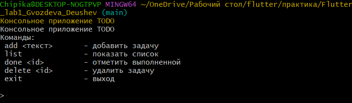

# Лабораторная работа №1. Быстрое погружение в язык Dart

---

## Консольное приложение ToDo

Простой туду-лист в консоли на Dart. Проект создан для освоения базовых концепций языка: защита от `null`, управление коллекциями, асинхронное программирование.

---

## Основная информация 

**ФИО:** Гвоздева В.А, Деушев Т.Т  
**Группа:** ИСП-231  
**Дата:** 22.05.2026 

---

## Скриншот приложения



---

## Как запустить проект

### 1. Клонировать репозиторий

```bash
### Скопировать репозиторий
git clone https://github.com/nika0-0-11/Flutter_lab1_Gvozdeva_Deushev

### Перейти в папку проекта
cd Flutter_lab1_Gvozdeva_Deushev/
```

### 2. Установить зависимотси

```bash
### Установить зависимости
dart pub get
```

### 3. Запустить приложение

```bash
### Перейти в папку bin/
cd bin/

### Запуск приложения
dart run todo_app.dart
```

---

## Что изучили

1. **Основы Dart** - синтаксис, пременные, типы данных, функции, классы 
2. **Null Safety** - разница между `String` (не может быть null) и `String?` (можеь быть null) 
3. **Коллекции и управление списком задач** - работы с `Lict`, добавление, удаление, поиск элементов
4. **Асинхронность** - использование `Future` и `async/await` для неблокирующих операций
5. **Работа с пакетами** - подлючение внешних библиотек черезе `pubspec.yaml` и `pub.dev`

---

## Ответы на вопросы

1. Чем **final** отличается от const в **Dart**?

- `final` - переменная получает значение один раз
- `const` - значение должно быть известно на этапе компиляции

2. Что означает String?

`String?` - это nullale-тип, то есть переменная может либо содержать строку, либо быть `null`

3. Чем Future отличается от обычного значения? Что означает await с точки зрения потока выполнения?

- **Обычное значение** - результат есть сразу
- `Future` - это значения, которое появится позже
- `await` - неблокирующее ожидание: поток не засыпает, а продолжает работать, а когда результат готов - возвращается к этому месту

4. Зачем в Dart именованные конструкторы, если в C# есть перегрузка?

В **Dart** нет перегрузки конструктора как C#. Вместо этого используют именованные конструкторы, например:

```dart
Todo(this.title) // обычный
Todo.empty() : id = 0; // именованный 
``` 

Это делает код понятнее - имя конструктора объясеяет его назначение
